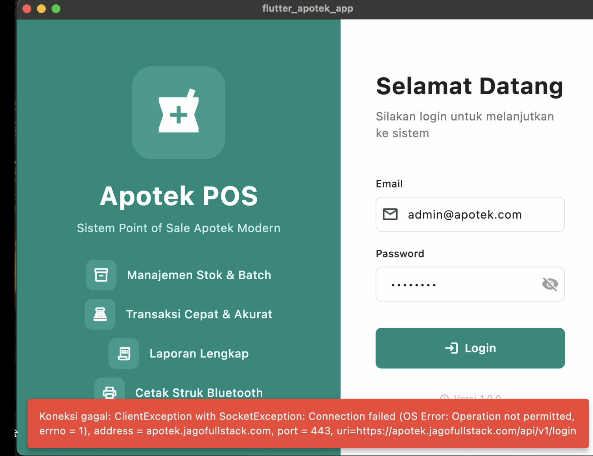

<div align="center">
  

  <h1>💊 Apotek POS - Flutter App</h1>
  <p><em>Aplikasi Point of Sale (POS) untuk Apotek berbasis Flutter dengan dukungan responsive layout untuk tablet dan smartphone.</em></p>

  [](https://flutter.dev/)
  [](https://dart.dev/)
  []()
</div>

<hr>

## ✨ Fitur Utama

- 🛒 **Point of Sale (POS)** - Transaksi penjualan dengan dukungan barcode scanner yang cepat.
- 📦 **Manajemen Produk** - Kelola produk, stok, dan batch dari satu layar yang intuitif.
- 👥 **Manajemen Pelanggan** - Catat data pelanggan dan lacak riwayat transaksi dengan mudah.
- 🕒 **Manajemen Shift** - Fitur buka/tutup shift kasir untuk akuntabilitas operasional.
- 🧾 **Riwayat Transaksi** - Telusuri transaksi sebelumnya dan cetak ulang struk secara instan.
- 📊 **Laporan Penjualan** - Pembuatan laporan harian dan berdasarkan periode yang komprehensif.
- 🖨️ **Bluetooth Printer** - Cetak struk nirkabel via thermal printer terintegrasi.
- 💳 **Xendit Payment** - Dukungan pembayaran digital (QRIS, GoPay, OVO, ShopeePay, dll).

## 📸 Screenshots & Preview

<div align="center">
  <h3>Phone & Tablet Layouts Supported!</h3>
</div>

| 📊 Dashboard | 🛍️ POS | 📝 Transaksi |
| :---: | :---: | :---: |
| _Ringkasan penjualan, alert stok rendah, dan produk kadaluarsa_ | _Keranjang belanja cerdas & pencarian produk instan_ | _Detail lengkap dan riwayat seluruh transaksi_ |

## 🛠️ Tech Stack

- **Framework:** Flutter 3.10+
- **State Management:** `flutter_bloc`
- **HTTP Client:** `http` package
- **Local Storage:** `shared_preferences`, `sqflite`
- **Functional Programming:** `dartz`
- **Bluetooth Printer:** `print_bluetooth_thermal`, `esc_pos_utils_plus`

## 📂 Arsitektur Direktori (Clean Architecture Pattern)

```text
lib/
├── core/
│   ├── components/       # Reusable widgets
│   ├── constants/        # Colors, variables
│   ├── extensions/       # Extension methods
│   ├── services/         # Printer service
│   ├── utils/            # Screen size utilities
│   └── widgets/          # Responsive layout
├── data/
│   ├── datasources/      # Remote & local datasources
│   └── models/           # Request & response models
└── presentation/
    ├── auth/             # Login/logout
    ├── customer/         # Manajemen pelanggan
    ├── dashboard/        # Dashboard & ringkasan
    ├── home/             # Home navigation
    ├── pos/              # Point of Sale
    ├── product/          # Manajemen produk
    ├── report/           # Laporan penjualan
    ├── settings/         # Pengaturan aplikasi
    ├── shift/            # Manajemen shift
    ├── stock/            # Stok rendah & kadaluarsa
    ├── store/            # Informasi toko
    └── transaction/      # Riwayat transaksi
```

## 🚀 Setup & Installation

### Prerequisites
- Flutter SDK 3.10+
- Dart SDK 3.0+
- Backend API (Laravel) running

### 1. Clone & Install

```bash
git clone https://github.com/afebrii/flutter-apotek-pos.git
cd flutter_apotek_pos
flutter pub get
```

### 2. Konfigurasi Endpoint

Atur API base URL Anda di `lib/core/constants/variables.dart`:
```dart
static const String baseUrl = 'https://your-api-domain.com/api/v1';
```

### 3. Run Aplikasi

```bash
flutter run
```

### 4. Build APK Release

```bash
flutter build apk --release
```

## 🔌 API Integration

Terintegrasi mulus dengan backend Laravel. Endpoint utama mencakup:
- **Auth:** `/login`, `/logout`, `/me`
- **Dashboard:** `/dashboard/summary`
- **POS & Shift:** `/shift/*`, `/sales`, `/xendit/*`
- **Master Data:** `/products`, `/categories`, `/customers`, `/store`

_Dokumentasi API lengkap dapat dilihat pada direktori backend atau `docs/API_INTEGRATION.md` (jika ada)._

## 📱 Responsive Layout Model

Dibangun untuk fleksibilitas maksimal, menangani dua layout secara otomatis:
- **Phone Layout**: Mobile devices (< 600dp)
- **Tablet Layout**: iPad / Android Tablets (>= 600dp) dengan Master-Detail view

```dart
ResponsiveLayout(
  phoneLayout: PhoneLayout(),
  tabletLayout: TabletLayout(),
)
```

## 🖨️ Setup Bluetooth Printer

1. _Pair_ printer thermal di pengaturan Bluetooth perangkat Android/iOS Anda.
2. Buka aplikasi, masuk ke **Pengaturan > Printer Bluetooth**.
3. Hubungkan ke printer yang terdeteksi (mendukung kertas **58mm** dan **80mm**).
4. Klik **Test Print**.

## 👥 Default User Roles & Login

| Role | Hak Akses |
| --- | --- |
| **Owner** | Penuh ke semua fitur |
| **Pharmacist**| Manajemen produk, penjualan, laporan |
| **Cashier** | Kasir (POS), shift, & transaksi harian |
| **Inventory** | Stok & pembelian |
| **Assistant** | View only mode |

**Akun Demo:**
> Email: `kasir@apotek.com`
> Password: `password`

## 🏷️ License
Proprietary - All rights reserved

---
<div align="center">
  <b>Developed by <a href="https://github.com/afebrii">afebrii</a> with Flutter 💙 & Laravel 🐘</b>
</div>
